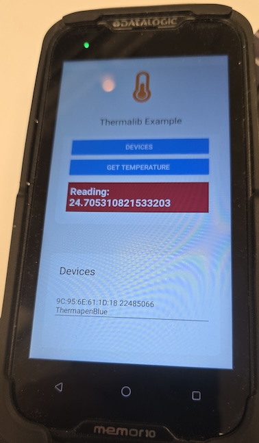

# thermalib-expo

ETI Bluetherm LE Protocol 1.1 integration


[](https://github.com/MobiDevel/thermalib-expo/actions/workflows/npm-publish.yml) [](https://www.npmjs.com/package/@mobione/thermalib-expo/) [](https://www.typescriptlang.org/)  [](https://expo.dev)


This is an integration to the thermalib SDK from the company ETI, to read temperature from their theromoter devices, e.g. Thermapen © Blue Theromoter (pictured).

- [thermalib-expo](#thermalib-expo)
- [Installation in managed Expo projects](#installation-in-managed-expo-projects)
- [Installation in bare React Native projects](#installation-in-bare-react-native-projects)
- [Usage](#usage)
- [Permissions](#permissions)
- [Scanning for devices](#scanning-for-devices)
  - [Get available devices](#get-available-devices)
  - [Connect to device](#connect-to-device)
  - [Read temperature](#read-temperature)
- [Configure for Android](#configure-for-android)
- [Configure for iOS](#configure-for-ios)
- [Running the Expo module example](#running-the-expo-module-example)
  - [Build the library](#build-the-library)
  - [Run the example project](#run-the-example-project)
- [Contributing](#contributing)

<small><i><a href='http://ecotrust-canada.github.io/markdown-toc/'>Table of contents generated with markdown-toc</a></i></small>

# Installation in managed Expo projects

```bash
npx expo install @mobione/thermalib-expo
```

# Installation in bare React Native projects

For bare React Native projects, you must ensure that you have [installed and configured the `expo` package](https://docs.expo.dev/bare/installing-expo-modules/) before continuing.

# Usage



Screenshot is from the included [example](./example/App.tsx).

# Permissions

When you call upon any function like `startScanning`, it is still imperative that you **request bluetooth permissions** first. The module includes a standard helper to achieve this.

```typescript
import { requestBluetoothPermission } from "thermalib-expo";

await requestBluetoothPermission();
```

# Scanning for devices

```typescript
import thermalib, { Device, requestBluetoothPermission } from "thermalib-expo";

export default function App() {
  const onChangePayload = useEvent(thermalib, "onChange");

  const startScanning = async () => {
    await requestBluetoothPermission();
    await thermalib?.startScanning();
    getDevices();
  };
...
}
```

[example/App.tsx](./example/App.tsx)

## Get available devices

```typescript
import thermalib, { Device, requestBluetoothPermission } from "thermalib-expo";
export default function App() {
  const [devices, setDevices] = useState<Device[]>([]);

  const getDevices = async () => {
    await requestBluetoothPermission();
    const devs = thermalib?.devices();
    if (devs) {
      setDevices(devs.map((d) => d as Device));
    } else {
      console.log("No devices");
    }
  };

  ...
}
```

## Connect to device

```typescript
import thermalib, { Device, requestBluetoothPermission } from "thermalib-expo";

export default function App() {
  const [selectedDev, setSelectedDev] = useState<Device | undefined>(undefined);

  const selectDevice = (deviceId: string) => {
    console.log("Fetch device", deviceId);
    const dev = thermalib.readDevice(deviceId) as { device?: Device };
    if (dev?.device?.deviceName) {
      setSelectedDev(dev.device);
    }
  };

  ...
}
```

[example/App.tsx](./example/App.tsx)

## Read temperature

```typescript
import thermalib, { Device, requestBluetoothPermission } from "thermalib-expo";

export default function App() {
  const [reading, setReading] = useState<number | undefined>(undefined);

  const getTemperature = (deviceId: string) => {
    console.log("Scan device", deviceId);
    const read = thermalib.readTemperature(deviceId) as {
      reading?: number;
    };
    setReading(read.reading);
  };

  ...
}
```

# Configure for Android

This library depends on Bluetooth LE (low energy) and will add the required permissions to your app. For Android, the following permissions are added. Remember to still [**ask for permissions**](#permissions) before calling any BT function.

```xml
  <uses-permission-sdk-23 android:name="android.permission.ACCESS_COARSE_LOCATION"/>
  <uses-permission-sdk-23 android:name="android.permission.ACCESS_FINE_LOCATION"/>
  <uses-permission android:name="android.permission.BLUETOOTH"/>
  <uses-permission android:name="android.permission.BLUETOOTH_ADMIN"/>
  <uses-permission android:name="android.permission.BLUETOOTH_CONNECT"/>
  <uses-permission android:name="android.permission.BLUETOOTH_SCAN" tools:targetApi="31"/>
  <uses-feature android:name="android.hardware.bluetooth_le" android:required="true"/>
```

# Configure for iOS

Run `npx pod-install` after installing the npm package.

# Running the Expo module example

## Build the library

```bash
npm run build # typescript
# in a separate terminal
npm run prepare
npm run prepub
npm run pods
```

## Run the example project

```bash
cd example
npm run prebuild
npm run pods
npm run android # or ios

```

For convenience, we've added a command that runs all the required steps from the root project:

`npm run android:build`

## Publish a new version

1. Commit and push your feature.
2. Up [version](https://docs.npmjs.com/about-semantic-versioning) in [`package.json`](./package.json) using the script `npm run version:next` or `yarn version:next`. This will tag and push to your branch.
3. PR and merge your branch.
4. [Draft a new Release](https://github.com/MobiDevel/thermalib-expo/releases) from that the new tag.
5. GitHub Action builds and publishes. The package becomes available in "packages" GitHub page.

# Contributing

Contributions are very welcome! Please refer to guidelines described in the [contributing guide](https://github.com/expo/expo#contributing).
