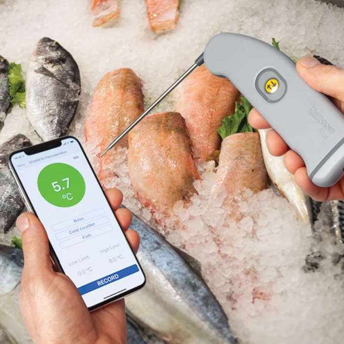

# thermalib-expo

ETI Bluetherm LE Protocol 1.1 integration



This is an integration to the thermalib SDK from the company ETI, to read temperature from their theromoter devices, e.g. Thermapen © Blue Theromoter (pictured).

# Installation in managed Expo projects

```bash
npx expo install thermalib-expo
```

# Installation in bare React Native projects

For bare React Native projects, you must ensure that you have [installed and configured the `expo` package](https://docs.expo.dev/bare/installing-expo-modules/) before continuing.

# Usage

This library depends on Bluetooth LE (low energy) and will add the required permissions to your app. For Android, the following permissions are added:

```xml
  <uses-permission-sdk-23 android:name="android.permission.ACCESS_COARSE_LOCATION"/>
  <uses-permission-sdk-23 android:name="android.permission.ACCESS_FINE_LOCATION"/>
  <uses-permission android:name="android.permission.BLUETOOTH"/>
  <uses-permission android:name="android.permission.BLUETOOTH_ADMIN"/>
  <uses-permission android:name="android.permission.BLUETOOTH_CONNECT"/>
  <uses-permission android:name="android.permission.BLUETOOTH_SCAN" tools:targetApi="31"/>
  <uses-feature android:name="android.hardware.bluetooth_le" android:required="true"/>
```

## Scanning for devices

When you call upon any function like `startScanning`, it is still imperative that you **request bluetooth permissions** first. The module includes a standard helper to achieve this:

```typescript

import thermalib, { Device, requestBluetoothPermission } from "thermalib-expo";

export default function App() {
  const onChangePayload = useEvent(thermalib, "onChange");

  const startScanning = async () => {
    await requestBluetoothPermission();
    await thermalib?.startScanning();
    getDevices();
  };
...
}
```

[example/App.tsx](./example/App.tsx)

## Get available devices

```typescript


import thermalib, { Device, requestBluetoothPermission } from "thermalib-expo";
export default function App() {
  const [devices, setDevices] = useState<Device[]>([]);

  const getDevices = async () => {
    await requestBluetoothPermission();
    const devs = thermalib?.devices();
    if (devs) {
      setDevices(devs.map((d) => d as Device));
    } else {
      console.log("No devices");
    }
  };

  ...
}
```

## Connect to device

```typescript

import thermalib, { Device, requestBluetoothPermission } from "thermalib-expo";

export default function App() {
  const [selectedDev, setSelectedDev] = useState<Device | undefined>(undefined);

  const selectDevice = (deviceId: string) => {
    console.log("Fetch device", deviceId);
    const dev = thermalib.readDevice(deviceId) as { device?: Device };
    if (dev?.device?.deviceName) {
      setSelectedDev(dev.device);
    }
  };

  ...
}
```

[example/App.tsx](./example/App.tsx)

## Read temperature

```typescript
import thermalib, { Device, requestBluetoothPermission } from "thermalib-expo";

export default function App() {
  const [reading, setReading] = useState<number | undefined>(undefined);

  const getTemperature = (deviceId: string) => {
    console.log("Scan device", deviceId);
    const read = thermalib.readTemperature(deviceId) as {
      reading?: number;
    };
    setReading(read.reading);
  };

  ...
}
```

# Configure for Android

No extra configuration needed.

# Configure for iOS

Run `npx pod-install` after installing the npm package.

##

# Running the Expo module example

## Build the library

```bash
npm run build # typescript
# in a separate terminal
npm run prepare
npm run prepub
npm run pods
```


## Run the example project

```bash
cd example
npm run prebuild
npm run pods
npm run android # or ios

```

For convenience, we've added a command that runs all the required steps from the root project:

`npm run android:build`

# Contributing

Contributions are very welcome! Please refer to guidelines described in the [contributing guide](https://github.com/expo/expo#contributing).
