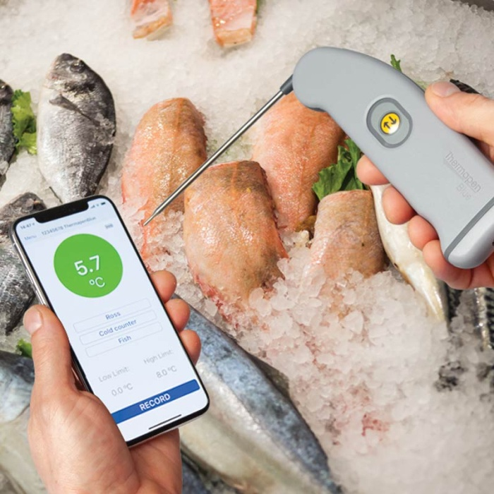
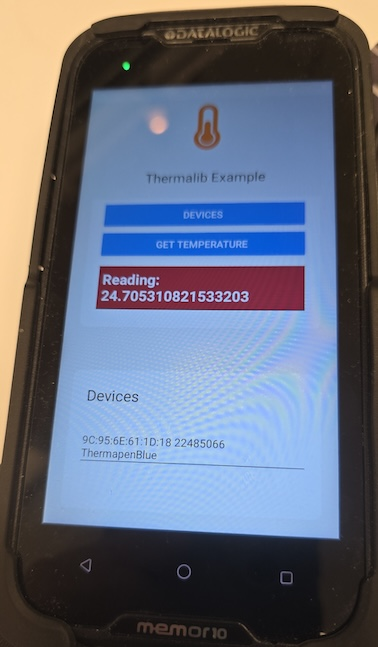

# thermalib-expo

ETI Bluetherm LE Protocol 1.1 integration

[](https://github.com/MobiDevel/thermalib-expo/actions/workflows/npm-publish.yml) [](https://www.npmjs.com/package/@mobione/thermalib-expo/) [](https://www.typescriptlang.org/)  [](https://expo.dev)



This is an integration to the thermalib SDK from the company ETI, to read temperature from their theromoter devices, e.g. Thermapen © Blue Theromoter (pictured).

- [thermalib-expo](#thermalib-expo)
  * [Read more](#read-more)
  * [Installation in managed Expo projects](#installation-in-managed-expo-projects)
  * [Installation in bare React Native projects](#installation-in-bare-react-native-projects)
  * [Usage](#usage)
  * [Permissions](#permissions)
  * [Scanning for devices](#scanning-for-devices)
    + [Get available devices](#get-available-devices)
    + [Connect to device](#connect-to-device)
    + [Read temperature](#read-temperature)
  * [Configure for Android](#configure-for-android)
  * [Configure for iOS](#configure-for-ios)
  * [Development workflow](#development-workflow)
  * [Running the Expo module example](#running-the-expo-module-example)
    + [Build the library](#build-the-library)
    + [Run the example project](#run-the-example-project)
    + [Publish a new version](#publish-a-new-version)
  * [Contributing](#contributing)

<small><i><a href='http://ecotrust-canada.github.io/markdown-toc/'>Table of contents generated with markdown-toc</a></i></small>

## Read more
<!-- TOC-START -->
<!-- TOC-END -->

## Installation in managed Expo projects
Note that you need to install [expo-location](https://docs.expo.dev/versions/latest/sdk/location/) as well to make BLE work on Android API >= 30.

Make sure to [configure your app.json](https://docs.expo.dev/versions/latest/sdk/location/#configuration-in-app-config) accordingly.

```bash
npx expo install @mobione/thermalib-expo expo-location
```

Add `@mobione/thermalib-expo` to your `app.json`to include the module in Expo build:

```json
// ./app.json
{
  "expo": {
    "name": "ThermalibApp",
    "slug": "thermalib",
    "version": "1.0.0",
    "orientation": "portrait",
    "plugins": [
      "@mobione/thermalib-expo",
    ]
  }
}
```

## Installation in bare React Native projects

For bare React Native projects, you must ensure that you have [installed and configured the `expo` package](https://docs.expo.dev/bare/installing-expo-modules/) before continuing.

## Usage



Screenshot is from the included [example](./example/App.tsx).

## Permissions

When you call upon any function like `startScanning`, it is still imperative that you **request bluetooth permissions** first. The module includes a standard helper to achieve this.

```typescript
import { requestBluetoothPermission } from "@mobione/thermalib-expo";

await requestBluetoothPermission();
```

## Scanning for devices

```typescript
import thermalib, { DeviceInfo, requestBluetoothPermission } from "@mobione/thermalib-expo";

export default function App() {
  const onChangePayload = useEvent(thermalib, "onChange");
  const buttonPressPayload = useEvent(thermalib, "onButtonPress");

  const startScanning = async () => {
    await requestBluetoothPermission();
    thermalib.initThermaLib?.();
    await thermalib?.startScanning();
    getDevices();
  };
...
}
```

[example/App.tsx](./example/App.tsx)

### Listen for device button presses

Subscribe to the `onButtonPress` native event to react when the user presses the physical button on a connected device.

```typescript
const buttonPressPayload = useEvent(thermalib, "onButtonPress");

useEffect(() => {
  if (buttonPressPayload?.identifier) {
    console.log("Button pressed:", buttonPressPayload.identifier);
  }
}, [buttonPressPayload]);
```

### Get available devices

```typescript
import { thermalib, Device, requestBluetoothPermission } from "@mobione/thermalib-expo";
export default function App() {
  const [devices, setDevices] = useState<DeviceInfo[]>([]);

  const getDevices = async () => {
    await requestBluetoothPermission();
    thermalib.initThermaLib?.();
    const devs = thermalib?.devices();
    if (devs) {
      setDevices(devs);
    } else {
      console.log("No devices");
    }
  };

  ...
}
```

### Connect to device

```typescript
import { thermalib, DeviceInfo, requestBluetoothPermission } from "@mobione/thermalib-expo";

export default function App() {
  const [selectedDev, setSelectedDev] = useState<DeviceInfo | undefined>(undefined);

  const selectDevice = async (deviceId: string) => {
    console.log("Fetch device", deviceId);
    const dev = thermalib.readDevice(deviceId);
    if (dev?.deviceName) {
      setSelectedDev(dev);
      await thermalib.connectDevice(deviceId);
    }
  };

  ...
}
```

[example/App.tsx](./example/App.tsx)

### Read temperature

```typescript
import { thermalib, Device, requestBluetoothPermission } from "@mobione/thermalib-expo";

export default function App() {
  const [reading, setReading] = useState<number | undefined>(undefined);

  const getTemperature = async (deviceId: string) => {
    console.log("Scan device", deviceId);
    thermalib.initThermaLib?.();
    const read = await thermalib.readTemperature(deviceId);
    setReading(read.reading);
  };

  ...
}
```

## Configure for Android

The `devices()` and `readDevice()` methods return a serialized `DeviceInfo` summary, not a live native SDK `Device` instance. Use `connectDevice()` and `readTemperature()` for native interactions.

This library depends on Bluetooth LE (low energy) and will add the required permissions to your app. For Android, the following permissions are added. Remember to still [**ask for permissions**](#permissions) before calling any BT function.

```xml
  <uses-permission-sdk-23 android:name="android.permission.ACCESS_COARSE_LOCATION"/>
  <uses-permission-sdk-23 android:name="android.permission.ACCESS_FINE_LOCATION"/>
  <uses-permission android:name="android.permission.BLUETOOTH"/>
  <uses-permission android:name="android.permission.BLUETOOTH_ADMIN"/>
  <uses-permission android:name="android.permission.BLUETOOTH_CONNECT"/>
  <uses-permission android:name="android.permission.BLUETOOTH_SCAN" tools:targetApi="31"/>
  <uses-feature android:name="android.hardware.bluetooth_le" android:required="true"/>
```

## Configure for iOS

Run `npx pod-install` after installing the npm package.

## Development workflow

For normal local development:

- Run `npm run build:watch` when you are changing files under `src/`.
- Rebuild the example app when you change native files under `ios/`, `android/`, or config-plugin code under `plugin/`.
- On iOS, rerun `cd example && npm run pods` after iOS native or pod-related changes, then run `cd example && npm run ios`.
- When upgrading the Expo SDK or React Native version in the example app, delete `example/ios` and `example/android` first, then rerun `cd example && npm run prebuild` and `cd example && npm run pods`. Treat those native folders as generated output after framework version bumps.

When to run the packaging scripts:

- `npm run prepare`: run this when you need Expo to regenerate module scaffolding or sync generated project files. It is useful before release checks and after changing module config, plugin wiring, or other package metadata. You do not need it for every Swift, Kotlin, or TypeScript edit.
- `npm run prepublishOnly` or `npm run prepub`: run this when you want to verify what will actually be published to npm. It prepares the package contents under `build/` and related publish artifacts. You usually do this before publishing or as part of `npm run verify`, not during normal example app development.

In short:

- Day-to-day app/module work: `build:watch`, `example` rebuilds, and `pods` when needed.
- Release/package validation: `prepare`, `prepub`, and `verify`.

## Running the Expo module example

### Build the library

```bash
npm run build:watch
```

Use `npm run prepare` and `npm run prepub` only when you are validating the package itself, not for every example build.

### Run the example project

```bash
cd example
npm run pods
npm run android # or ios

```

For convenience, we've added a command that runs all the required steps from the root project:

`npm run android:build`

### Publish a new version

1. Commit and push your feature.
2. PR and merge your branch to `main` or `development`.
3. Run the `Release` GitHub Action manually from the Actions tab and choose the semantic version bump (`patch`, `minor`, or `major`) plus the ClickUp task ID.
4. The release workflow verifies the package, bumps the version, updates changelog artifacts, pushes the release commit and tag, creates the GitHub Release, and publishes to npm.

## Contributing

Contributions are very welcome! Please refer to guidelines described in the [contributing guide](https://github.com/expo/expo#contributing).
